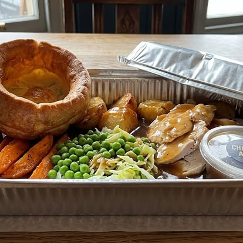

# The Chandos Arms — website

A small, fast, dependency-free website for **The Chandos Arms**, 1 Main Street, Weston Turville, Buckinghamshire, HP22 5RR · ☎ 01296 613532.

Plain HTML, CSS and a little vanilla JavaScript — no build step, no frameworks. Just open the files or drop the folder onto any static host.

## Run it locally

From this folder:

```bash
python3 -m http.server 8000
```

Then open <http://localhost:8000>. (Any static server works.)

## Files

| File / folder | What it is |
| --- | --- |
| `index.html` | Home |
| `menu.html` | Food &amp; Drink |
| `whats-on.html` | What's On / events |
| `our-story.html` | Our Story (history &amp; the village) |
| `find-us.html` | Find Us (hours, map, contact) |
| `css/styles.css` | All styling + the design system (colours, fonts) |
| `js/main.js` | Mobile menu, scroll animations, "today" hours highlight, footer year |
| `assets/logo.svg` | Crest logo (recreated) · `assets/favicon.svg` browser icon |
| `images/` | Photos used on the site |
| `images/_source/` | The raw saved Facebook export (kept for reference, **not** used by the site) |

## Editing common things

- **Text / wording:** open the relevant `.html` file and edit the text between the tags.
- **Phone number:** appears as `tel:+441296613532` (links) and `01296 613532` (display). Search/replace both if it ever changes.
- **Opening hours:** edit the two `<table class="hours">` blocks (in `index.html` and `find-us.html`). The current day is auto-highlighted via the `data-day` attribute (`0` = Sunday … `6` = Saturday).
- **Menu items:** edit the `<li class="menu-item">` blocks in `menu.html`.
- **Colours &amp; fonts:** the `:root { … }` block at the top of `css/styles.css` controls the whole palette and typography.

## Adding real photos (image slots)

Several spots show a dashed **"Photo slot"** placeholder. To swap one in:

1. Drop your photo into `images/` (e.g. `images/sunday-roast.jpg`).
2. In the page, replace the whole `<div class="slot …">…</div>` with:
   ```html
   
   ```
   (The surrounding `.frame` / `.split__media` keeps it nicely framed.)

Good photos to capture: the bar interior, a plated Sunday roast, food close-ups, a well-poured pint, and the garden in summer.

## Photos currently in use

| Image | Source | Note |
| --- | --- | --- |
| `exterior-hero.jpg` | The pub's saved Facebook page | ⚠️ Carries an **"EDK Photography"** watermark — see go-live checklist. |
| `marquee-sport.jpg`, `marquee-flags.jpg`, `garden-benches.jpg` | The pub's own Facebook posts | Used on What's On / Home. |

## ✅ Before you go live

A few things are best confirmed by the pub before publishing — they were uncertain or varied between online sources:

- [ ] **Opening &amp; kitchen hours** — the times shown are a reasonable guide; confirm the real bar and food-service hours.
- [ ] **Email address** — `info@thechandosarms.co.uk` is a placeholder. Set the real address (search/replace `info@thechandosarms.co.uk`).
- [ ] **Menu &amp; prices** — verified items: the Monday £10 specials, the pizzas and the Sunday roast. Other dishes are a representative sample; confirm the current menu and add prices if wanted.
- [ ] **Events** — confirm the quiz night day/time and any regular live-music schedule.
- [ ] **Image rights** — the exterior hero shot is watermarked "EDK Photography". Get permission/a licensed copy, or replace it with your own photo of the pub.
- [ ] **Add real photos** into the labelled slots (roast, bar, drinks).
- [ ] **Map marker** — the OpenStreetMap marker on Find Us is approximate; nudge the `marker=` / `bbox=` values in `find-us.html` if you want it spot-on.

## Hosting (free options)

This is a static site, so it's free and easy to host:

- **Netlify** — drag-and-drop this folder at app.netlify.com, or connect a Git repo.
- **GitHub Pages** — push to a repo and enable Pages.
- **Cloudflare Pages** — similar drag-and-drop / Git flow.

Point your domain (e.g. `thechandosarms.co.uk`) at whichever you choose.
